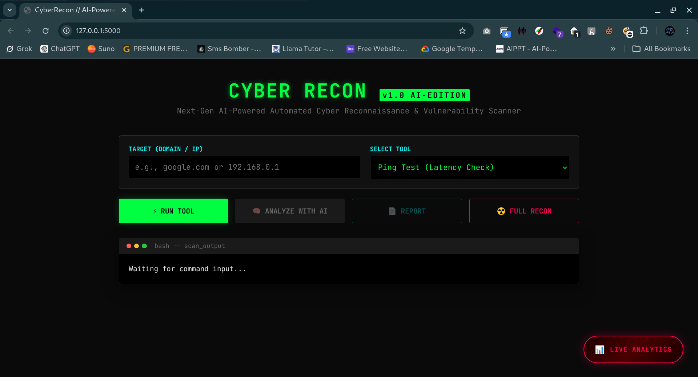
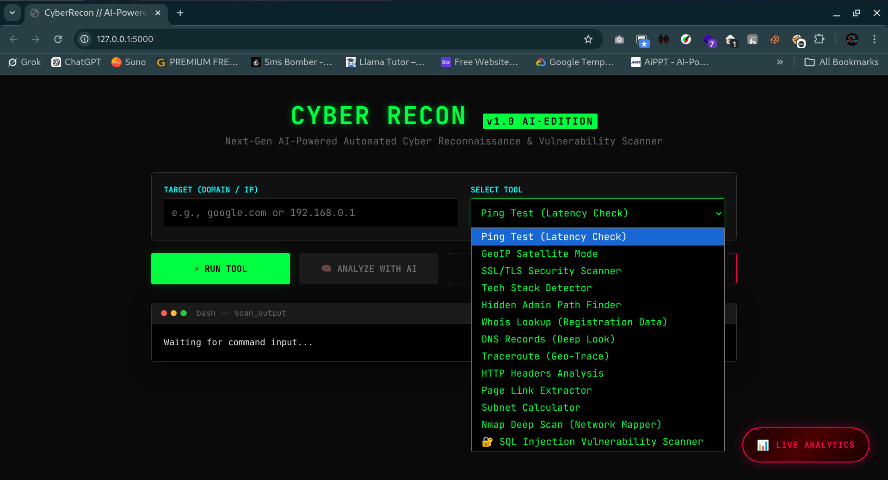
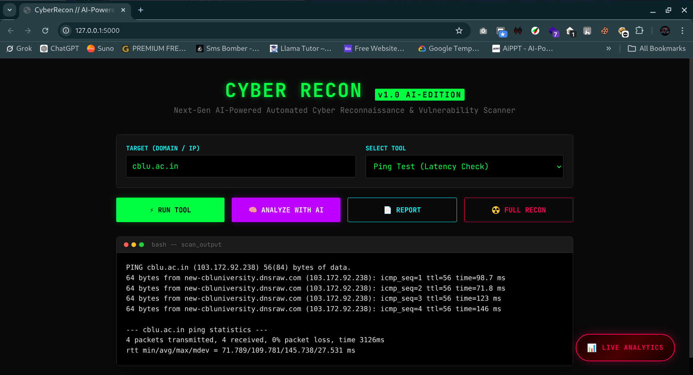
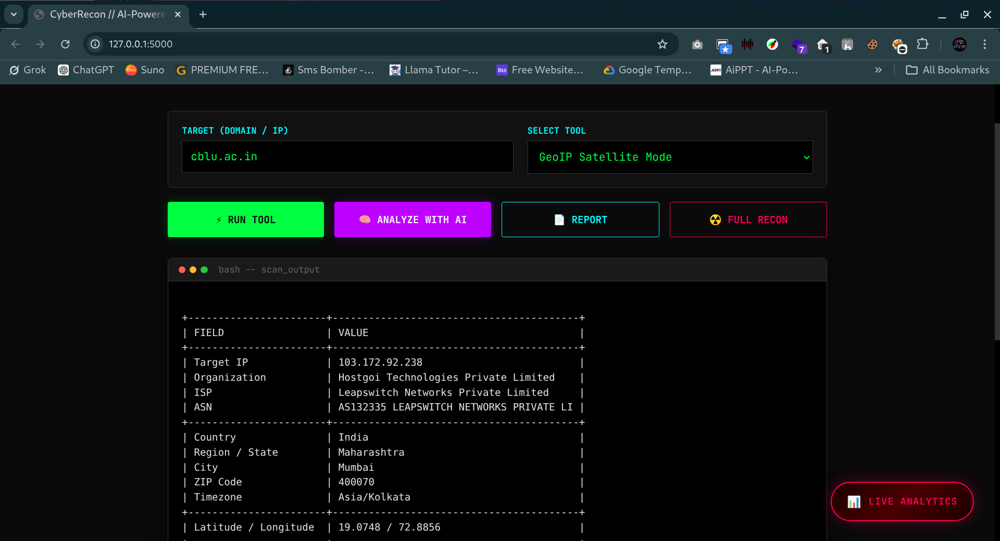
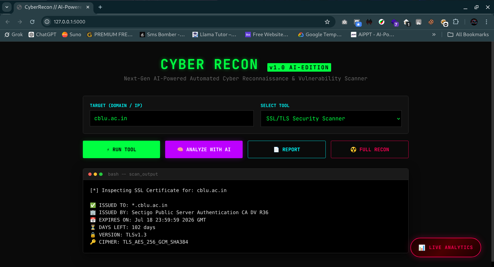
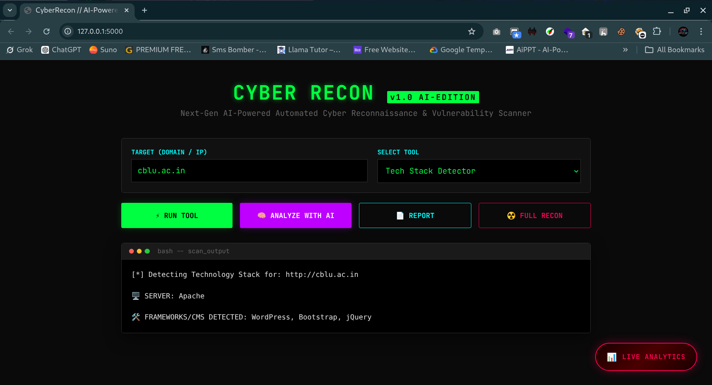

<div align="center">

```
 ██████╗██╗   ██╗██████╗ ███████╗██████╗     ██████╗ ███████╗ ██████╗ ██████╗ ███╗   ██╗
██╔════╝╚██╗ ██╔╝██╔══██╗██╔════╝██╔══██╗    ██╔══██╗██╔════╝██╔════╝██╔═══██╗████╗  ██║
██║      ╚████╔╝ ██████╔╝█████╗  ██████╔╝    ██████╔╝█████╗  ██║     ██║   ██║██╔██╗ ██║
██║       ╚██╔╝  ██╔══██╗██╔══╝  ██╔══██╗    ██╔══██╗██╔══╝  ██║     ██║   ██║██║╚██╗██║
╚██████╗   ██║   ██████╔╝███████╗██║  ██║    ██║  ██║███████╗╚██████╗╚██████╔╝██║ ╚████║
 ╚═════╝   ╚═╝   ╚═════╝ ╚══════╝╚═╝  ╚═╝   ╚═╝  ╚═╝╚══════╝ ╚═════╝ ╚═════╝ ╚═╝  ╚═══╝
```

# 🛡️ CYBER RECON — AI-Powered Automated Cyber Reconnaissance Platform

**Advanced Security Intelligence. Zero Expertise Required.**

[](https://python.org)
[](https://flask.palletsprojects.com/)
[](https://firebase.google.com/)
[](https://ai.google.dev/)
[](LICENSE)
[](https://www.bljscollege.com/)

<br/>

> *"Bridging the gap between enterprise-grade security and accessibility — one scan at a time."*

<br/>

🎥 **[Watch Demo Video](https://drive.google.com/file/d/1Id0oX9el3tm17ikh4uf3hexkHbWpYkQa/view?usp=sharing)** &nbsp;|&nbsp; 📄 **[Project report (Word)](./docs/CyberRecon_Report.docx)** &nbsp;|&nbsp; 📊 **[Presentation (PPTX)](./docs/CyberRecon_Presentation.pptx)** &nbsp;|&nbsp; 🖼️ **[Screenshots](./screenshots/)**

</div>

> **Gallery:** [`screenshots/`](./screenshots/) — `ui-01.png` … `ui-43.png`. To add more PNGs later, run `python3 scripts/normalize_screenshots.py` from the repo root.

---

## 📌 Table of Contents

- [Overview](#-overview)
- [Problem Statement](#-problem-statement)
- [Key Features](#-key-features)
- [13 Scanning Modules](#-13-scanning-modules)
- [Cortex AI Intelligence Engine](#-cortex-ai--the-intelligence-engine)
- [Tech Stack](#-tech-stack)
- [System Architecture](#-system-architecture)
- [Project Structure](#-project-structure)
- [Installation & Setup](#-installation--setup)
- [Usage](#-usage)
- [Screenshots & Output](#-screenshots--output)
- [Live Analytics Dashboard](#-live-analytics-dashboard)
- [Future Roadmap](#-future-roadmap)
- [Team](#-team)
- [Disclaimer](#-disclaimer)

---

## 🔍 Overview

**CyberRecon** is a next-generation, **AI-Powered Automated Cyber Reconnaissance and Vulnerability Scanning Platform**, developed as a **Final Year BCA Group Project** at *Banwari Lal Jindal Suiwala College, Tosham (Bhiwani)* under **Chaudhary Bansi Lal University, Bhiwani** for the session **2023–2026**.

In the modern digital landscape, cybersecurity has become one of the most critical domains. Manual reconnaissance and vulnerability assessment are **time-consuming, error-prone, and require deep technical expertise**. CyberRecon addresses this gap by providing:

- ✅ A **unified browser-based interface** integrating 13+ powerful security tools
- ✅ **Google Gemini AI** for human-readable, actionable intelligence reports
- ✅ **Firebase Realtime Database** for persistent scan history and analytics
- ✅ **Automated PDF report generation** with professional formatting
- ✅ **Full Recon Mode** — complete reconnaissance in a single click (~10 seconds)

---

## ❗ Problem Statement

| Problem | Impact |
|---------|--------|
| ↑47% increase in cyberattacks targeting educational institutions & SMBs (2025-26) | AIIMS Delhi Attack, ICMR Data Leak, College Portal Breaches |
| Enterprise tools are prohibitively expensive | SMBs and institutions are left unprotected |
| Tools like Kali Linux require deep expertise | Non-technical users cannot leverage security tools |
| Organizations act only *after* a breach occurs | Reactive defense instead of proactive security |

> **CyberRecon bridges this gap by making enterprise-grade protection accessible to everyone, regardless of technical expertise or budget.**

---

## ✨ Key Features

| Feature | Description |
|---------|-------------|
| 🔬 **13 Scanning Modules** | Comprehensive arsenal covering Network, Web, DNS & Application layers |
| 🤖 **Cortex AI Engine** | Powered by Google Gemini — transforms raw scan data into actionable intelligence |
| 📄 **Automated PDF Reports** | Branded, professional-grade CONFIDENTIAL intelligence dossiers |
| 📊 **Live Analytics Dashboard** | Real-time vulnerability tracking, scan history, export to JSON/CSV |
| ☁️ **Firebase Integration** | Persistent cloud-based scan history accessible across sessions |
| ⚡ **Full Recon Mode** | Single-click execution of all 13 tools with consolidated PDF report |
| 🔊 **Audio Read-Aloud** | AI-generated reports with text-to-speech output |
| 🖥️ **Terminal-Style UI** | Dark cyberpunk interface with real-time tool output |

---

## 🛠️ 13 Scanning Modules

| Sr No. | Module | Description |
|---|--------|-------------|
| 01 | 🌐 **Ping Test** | ICMP latency check — round-trip time, packet loss, network reachability |
| 02 | 🛰️ **GeoIP Satellite Mode** | Resolves IP, retrieves country, city, ISP, ASN & coordinates |
| 03 | 🔐 **SSL/TLS Security Scanner** | Inspects certificates — issuer, expiry, TLS version, cipher suite |
| 04 | 🧠 **Tech Stack Detector** | Identifies server technology, CMS, JavaScript frameworks |
| 05 | 🔑 **Hidden Admin Path Finder** | Scans for common admin login paths and potential entry points |
| 06 | 📋 **WHOIS Lookup** | Full domain registration data — registrar, creation date, expiry, owner |
| 07 | 🔎 **DNS Records Deep Look** | Fetches all DNS record types — A, MX, NS, TXT |
| 08 | 🗺️ **Traceroute Geo-Trace** | Advanced TCP traceroute with Firewall Bypass Mode — maps each hop |
| 09 | 📡 **HTTP Headers Analysis** | Analyzes all HTTP response headers, highlights missing security headers |
| 10 | 🔗 **Page Link Extractor** | Crawls target page, extracts all internal and external hyperlinks |
| 11 | 🧮 **Subnet Calculator** | Computes network class, broadcast address, host ranges from target IP |
| 12 | 🗄️ **Nmap Deep Scan** | Full SYN scan with OS detection and version identification (top 1000 ports) |
| 13 | 💉 **SQL Injection Scanner** | Multi-phase automated SQLi vulnerability detection and analysis |

---

## 🤖 Cortex AI — The Intelligence Engine

Powered by **Google Gemini**, Cortex AI processes raw scan outputs and generates structured **four-section intelligence reports**:

```
┌─────────────────────────────────────────────────┐
│          CORTEX AI INTELLIGENCE REPORT          │
├─────────────────────────────────────────────────┤
│  01. Executive Threat Assessment                │
│  02. Technical Vulnerability Details            │
│  03. Attack Simulation (Hacker's Perspective)   │
│  04. Strategic Countermeasures                  │
└─────────────────────────────────────────────────┘
```

**Risk Classification:**
- 🟢 `SAFE` — Low Risk
- 🟡 `CAUTION` — Medium Risk
- 🔴 `CRITICAL` — High Risk

---

## 💻 Tech Stack

| Category | Technology | Purpose |
|----------|-----------|---------|
| **Backend** | Python 3.x | Core server-side logic and security tool modules |
| **Framework** | Flask | Lightweight REST API server and routing |
| **Frontend** | HTML5 / CSS3 / JavaScript (ES6+) | Dynamic UI, real-time output, scanner interface |
| **AI Engine** | Google Gemini API | Intelligence report generation from scan data |
| **Database** | Firebase Realtime Database | Persistent scan history and analytics storage |
| **Security** | Nmap, SQLmap (Emulated), tcptraceroute | Deep scanning, injection testing, network tracing |
| **Networking** | Python socket / dnspython | DNS lookups, ping, subnet calculations |
| **Reports** | ReportLab (pdf_generator.py) | Branded PDF report generation |
| **OS** | Kali Linux | Primary development and runtime environment |
| **Version Control** | Git | Source code management |

---

## 🏗️ System Architecture

```
┌─────────────────────────────────────────────────────────────────┐
│                        USER BROWSER                             │
│                  index.html / dashboard.html                    │
└───────────────────────────┬─────────────────────────────────────┘
                            │ HTTP Fetch API
                            ▼
┌─────────────────────────────────────────────────────────────────┐
│                   FLASK BACKEND (app.py)                        │
│                  REST API — Business Logic                      │
└──────────┬──────────────────────────────────┬───────────────────┘
           │                                  │
           ▼                                  ▼
┌──────────────────────┐          ┌───────────────────────┐
│   TOOLS LAYER        │          │    AI PROCESSING      │
│  /backend/tools/     │          │    ai_analyst.py      │
│  13 Python Modules   │          │    Google Gemini API  │
└──────────────────────┘          └───────────────────────┘
           │                                  │
           ▼                                  ▼
┌──────────────────────┐          ┌───────────────────────┐
│  PDF REPORT LAYER    │          │  DATA PERSISTENCE     │
│  pdf_generator.py    │          │  Firebase Realtime DB │
│  CONFIDENTIAL PDFs   │          │  (Google Cloud, SG)   │
└──────────────────────┘          └───────────────────────┘
```

CyberRecon follows a **three-tier client-server architecture** with an additional **AI processing layer** and **cloud-based data persistence layer**.

---

## 📁 Project Structure

```
CYBER-RECON/
│
├── 📂 backend/
│   ├── 📂 tools/
│   │   ├── ping.py              # Ping / Latency Check
│   │   ├── geoip.py             # GeoIP Satellite Mode
│   │   ├── ssl_scanner.py       # SSL/TLS Security Scanner
│   │   ├── tech_detect.py       # Tech Stack Detector
│   │   ├── admin_finder.py      # Hidden Admin Path Finder
│   │   ├── whois.py             # WHOIS Lookup
│   │   ├── dns.py               # DNS Records Deep Look
│   │   ├── traceroute.py        # Traceroute Geo-Trace
│   │   ├── headers.py           # HTTP Headers Analysis
│   │   ├── links.py             # Page Link Extractor
│   │   ├── subnet.py            # Subnet Calculator
│   │   ├── nmap_safe.py         # Nmap Deep Scan
│   │   ├── sqli.py              # SQL Injection Scanner
│   │   └── ai_analyst.py        # Gemini AI Integration (Cortex AI)
│   │
│   ├── 📂 report/
│   │   └── pdf_generator.py     # PDF Report Generator (ReportLab)
│   │
│   ├── firebase_db_simple_rest_api.py   # Firebase REST API Handler
│   └── app.py                   # Main Flask Application Entry Point
│
├── 📂 frontend/
│   ├── index.html               # Main Scanner Interface
│   ├── dashboard.html           # Live Analytics Dashboard
│   ├── app.js                   # Frontend Application Logic
│   └── style.css                # Dark Cyberpunk UI Styles
│
├── 📂 docs/
│   ├── CyberRecon_Report.docx         # Full project report (Word)
│   └── CyberRecon_Presentation.pptx     # Slides (PowerPoint)
│
├── 📂 screenshots/
│   ├── README.md                # Gallery notes
│   └── ui-01.png … ui-43.png    # UI captures (43 images)
│
├── 📂 scripts/
│   └── normalize_screenshots.py # Renames PNGs to ui-01, ui-02, …
│
├── requirements.txt             # Python Dependencies (repo root)
├── env.example                  # Copy to `.env` — API keys & Firebase URL
├── LICENSE                      # Educational use license
├── run_linux.sh                 # Linux/Kali Startup Script
├── run_windows.bat              # Windows Startup Script
├── .gitignore                   # Git Ignore Rules
└── README.md                    # This File
```

---

## ⚙️ Installation & Setup

### Prerequisites

```bash
# Required
sudo apt update && sudo apt install -y python3 python3-pip nmap tcptraceroute

# Clone the repository
git clone https://github.com/CyberNiteshHub/CYBER-RECON.git
cd CYBER-RECON
```

### Install Dependencies

```bash
pip3 install -r requirements.txt
cp env.example .env
# Edit .env: set GEMINI_API_KEY and optionally FIREBASE_DATABASE_URL
```

**requirements.txt** includes (see file for exact pins/versions you may add later):
```
flask
requests
beautifulsoup4
dnspython
reportlab
python-nmap
urllib3
google-generativeai
sqlmap
python-dotenv
```

### Configuration

1. Copy `env.example` to `.env` in the **repository root** (same folder as `README.md`).
2. Set **`GEMINI_API_KEY`** — from [Google AI Studio](https://ai.google.dev/).
3. Set **`FIREBASE_DATABASE_URL`** — your Firebase Realtime Database root URL (optional; dashboard/history features stay off until this is set).

The backend loads `.env` automatically via `python-dotenv` when you start `backend/app.py`.

### Run the Application

```bash
# Linux / Kali Linux
chmod +x run_linux.sh
sudo ./run_linux.sh

# OR manually
sudo python3 backend/app.py
```

Then open your browser and go to:
```
http://localhost:5000
```

---

## 🚀 Usage

1. **Open** `http://localhost:5000` in your browser
2. **Enter** the target domain or IP address (e.g., `example.com`)
3. **Select** a scanning tool from the 13 available modules (or choose **Full Recon**)
4. **Click** the scan button and watch real-time terminal-style output
5. **Click** `Generate AI Report` to get Cortex AI intelligence analysis
6. **Download** the PDF report or view the Live Analytics Dashboard

> ⚠️ **Always use on authorized targets only. Unauthorized scanning is illegal.**

---

## 📸 Screenshots & Output

**43 UI captures** in [`screenshots/`](./screenshots/) (`ui-01.png` … `ui-43.png`). Preview (first six — chronological):

| | |
|:--:|:--:|
|  |  |
|  |  |
|  |  |

*Remaining frames: `ui-07.png` through `ui-43.png` in the same folder.*

Key outputs demonstrated on `cblu.ac.in` (CBLU University — authorized target):

- **GeoIP:** IP `103.172.92.238` → Mumbai, Maharashtra, India
- **SSL/TLS:** Issued by Sectigo, TLSv1.3, AES-256-GCM-SHA384
- **Tech Stack:** Apache + WordPress + Bootstrap + jQuery
- **DNS Records:** Complete A, MX, NS, TXT record set
- **Page Links:** 253 links extracted
- **Nmap:** 14 open ports detected with service versions
- **AI Report:** Four-section Gemini-powered intelligence dossier

---

## 📊 Live Analytics Dashboard

The **dashboard.html** provides a centralized security intelligence hub:

| Metric | Description |
|--------|-------------|
| 📈 Total Scans | Real-time count of all scans performed |
| 🔴 High Risk | Critical vulnerability count |
| 🟡 Medium Risk | Moderate vulnerability count |
| 🟢 Low Risk | Low-severity finding count |
| 🕵️ Scan History | Searchable table with target, time, status |
| 📥 Export | Download scan data as JSON or CSV |

**Firebase Database Capacity:** 10 GB (Google Cloud, Singapore Region)

---

## 🔮 Future Roadmap

| Phase | Feature | Status |
|-------|---------|--------|
| 🚀 Phase 1 | Cloud/SaaS Deployment | In Progress |
| 🤖 Phase 2 | Auto-Fix & Predictive AI | Coming Soon |
| 👁️ Phase 3 | 24/7 Monitoring + Dark Web Check | Planned |
| 🏢 Phase 4 | SIEM/SOC Integration + Mobile Apps | Vision |

Additional planned enhancements:
- User Authentication & Role Management (Admin, Analyst, Viewer)
- Real-time Streaming Output via WebSocket / SSE
- Scheduled & Recurring Scans with email alerts
- CVE Lookup Integration (NVD Database)
- Docker Containerization for one-command deployment
- Deep Recursive Web Crawler
- Mobile-Responsive Interface

---

## 👥 Team

**Final Year BCA Group Project | Session 2023–2026**
**Banwari Lal Jindal Suiwala College, Tosham (Bhiwani)**
**Chaudhary Bansi Lal University, Bhiwani**

| Name | Role |
|------|------|
| **Nitesh Verma** | Project Lead, Full-Stack Developer, AI Integration |
| **Asha** | Team Member |
| **Mohit** | Team Member |
| **Sanju** | Team Member |
| **Hardeep Sharma** | Team Member |
| **Prem** | Team Member |
| **Rohit** | Team Member |
| **Dharambir Singh** | Team Member |

**Project Guide:** Mrs. Manju, Assistant Professor (Computer Science & Applications), BLJS College, Tosham

📧 Contact: [niteshkumar3133845@gmail.com](mailto:niteshkumar3133845@gmail.com)
🐙 GitHub: [@CyberNiteshHub](https://github.com/CyberNiteshHub)

---

## ⚖️ Disclaimer

> **CyberRecon is developed strictly for educational purposes and authorized security testing only.**
>
> All testing was performed on systems owned by the team or on publicly available test environments (e.g., `testphp.vulnweb.com`). The team strictly adheres to **ethical hacking principles** and **responsible disclosure practices**.
>
> **Unauthorized scanning of systems without explicit permission is illegal and unethical. The developers are not responsible for any misuse of this tool.**

---

## 📚 References

- [Flask Documentation](https://flask.palletsprojects.com/)
- [Firebase Realtime Database](https://firebase.google.com/docs/database)
- [Google Gemini AI API](https://ai.google.dev/)
- [Nmap Reference Guide](https://nmap.org/book/man.html)
- [OWASP Testing Guide v4.2](https://owasp.org/www-project-web-security-testing-guide/)
- [SQLmap Documentation](https://sqlmap.org/)
- [Python Documentation](https://docs.python.org/3/)

---

<div align="center">

**⭐ If this project helped you, please consider giving it a star!**

```
Securing the digital world, one scan at a time.
```

*Made with ❤️ by Team CyberNiteshHub | BLJS College Tosham | BCA 2023–26*

</div>
